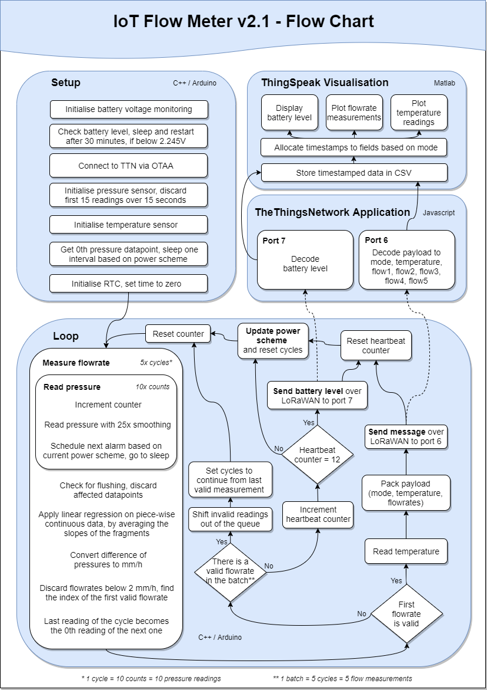

# IoT_flow_meter
IoT Enabled Low Power Flow Meter repository for 2019-20 Individual Project at the University of Southampton


## Prerequisites
To develope code for the flow meter, the [STM32L0 Arduino Core](https://github.com/GrumpyOldPizza/ArduinoCore-stm32l0) is required.


### Installation
* Go to preferences in the Arduino IDE, and add ```https://grumpyoldpizza.github.io/ArduinoCore-stm32l0/package_stm32l0_boards_index.json``` as an additional Board Manager URL
* Install ```Tlera Corp STM32L0 Boards``` in the Boards Manager under the Tools section. 
* In the Board Menu, choose **Grasshopper-L082CZ**, and set the following preferences: 
  * No USB
  * No DOSFS
  * 32 MHz
  * Smallest Code


### Upload
To upload code to the flow meter, go to preferences, and tick the box to show verbose output during compilation. The commands used to compile the code will be visible in the IDE after an attempted compilation. Take these commands and modify them to save the build inside the project folder. Open the command prompt and convert the .elf file into a .hex file. Download the [STM32CubeProgrammer](https://www.st.com/en/development-tools/stm32cubeprog.html) application from STMicroelectronics. The .hex file can be uploaded via a USB to serial converter, such as the [C232HM FTDI cable](https://www.ftdichip.com/Products/Cables/USBMPSSE.htm), by using the cube programmer after having entered the bootloader of the device. The bootloader is activated by pressing the reset and the boot button simultaneously. Uploading code to the device includes many steps, therefore, it is recommended to use the command line feature of the cube programmer and create a batch file.


### Gitignore
keys.h is required to connect to TTN. See useful links to obtain the App EUI, App Key, and Dev EUI.


### Useful Links
* [TheThingsNetwork - Device Registration](https://www.thethingsnetwork.org/docs/devices/registration.html)
* [ThingSpeak](https://thingspeak.com/)
* [Get Device EUI](https://github.com/kriswiner/CMWX1ZZABZ/blob/master/Grasshopper/LoRaWAN_GetDevEUI.ino)


## Flow Chart

